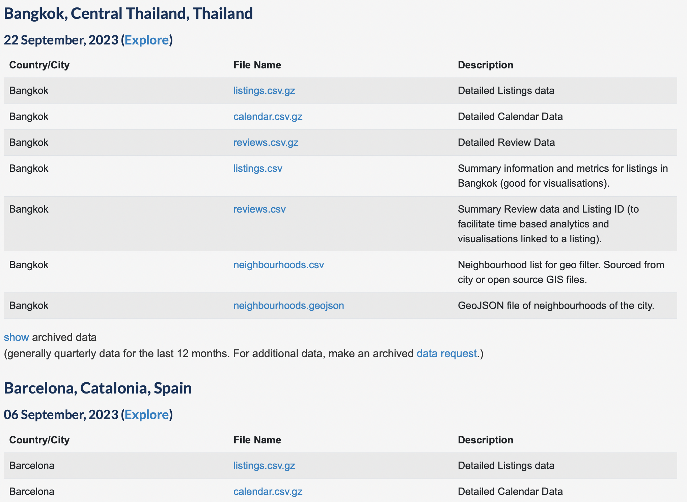

# Github Intro Guide
<<<<<<< HEAD
This is the completed task of replication. 
=======
This is the complected task of replication. 
>>>>>>> 9e4e2088c6127a48854fa2f16c8adce16c2aa06f
## Getting Started

1.Ensure that [git lfs](https://git-lfs.github.com) and Python 3.10 are installed. I use MacOS system and Github online. So, it is recommended to use [Homebrew](https://brew.sh) to install git lfs. 

2. Open a shell to the location where you wish to store the repo. You should avoid storing the repo in a synced directory (i.e., do not store it in a Dropbox, Box, or iCloud folder. Note that on many Macs, the Desktop and Documents folder is synced with iCloud.). Once you have navigated to the location where you wish to store the repo, clone the repository, and navigate to its root.
<<<<<<< HEAD
```bash
git lfs clone https://github.com/sz549/Github_Intro_Guide.git
cd Github_Intro_Guide
git lfs install
```
3. I use Visual Studio Code to edit Python codes, so I choose to refer to public online resource like [Zhihu](https://zhuanlan.zhihu.com/p/624521466). It shows the details on how to link VSC to Github and how to push. 
=======
    ```bash
    git lfs clone https://github.com/sz549/Github_Intro_Guide.git
    cd Github_Intro_Guide
    git lfs install
    ```
3. I use Visual Studio Code to edit Python codes, so I choose to refer to public online resourse like [Zhihu](https://zhuanlan.zhihu.com/p/624521466). It shows the details on how to link VSC to Github and how to push. 

>>>>>>> 9e4e2088c6127a48854fa2f16c8adce16c2aa06f

## Rating RD Design Replication Exercise 

For this simple replication exercise, I want you to replicate a simple exercise using the [Airbnb 
public data](http://insideairbnb.com/get-the-data/). We want to see what is the effect of rating on sales.
In order to be able to do the casual inference, one way in the literature is to use the left-digit bias in rating.
That is, consumers value rating 4.05 much higher than rating 3.95. But the true qualities of listings near 
the rating of 4 are very close. If we do see there is a `jump` of sales at the cutoff of 4, we could argue
this is the casual effect of rating on sales. 

We want to do this RD exercise using the Airbnb public data. The goal is to see whether there is a 
clear jump on sales, as approximated by new reviews, near rating at 4 for listings. The guidance is as below: 

1. Go to [Airbnb public data](http://insideairbnb.com/get-the-data/) and download the Bangkok's listings.csv.gz. However, downloaded file is .csv format. Repeat 3 times to ensure they are quarterly data for the last 12 months. Save the data into the path 'data/raw/Bangkok'. The goal is to construct a panel data with 4 screenshots. 



2. Run the code below for data cleaning. 

```bash
python code/data_cleaning.py
```
3. Run the code below to get the RD graph. 

```bash
python code/rating_rd.py
```

## My RD graph (Bangkok)

### explanation on graph
The fitted line sharply increase when listings is near rating at 4. 
It follows the reference figure as the change is positive. 
### code editing explanation
As the downloaded data ends with .csv instead of .csv.gz, I change the reading function as below
```
for filename in os.listdir(directory):
if filename.endswith('.csv'):
file_path = os.path.join(directory, filename)

with open(file_path, 'rt', encoding='utf-8') as f:
df = pd.read_csv(f)
### as the downloaded data is not end with csv.gz, using open is accessable
dataframes.append(df)
```

