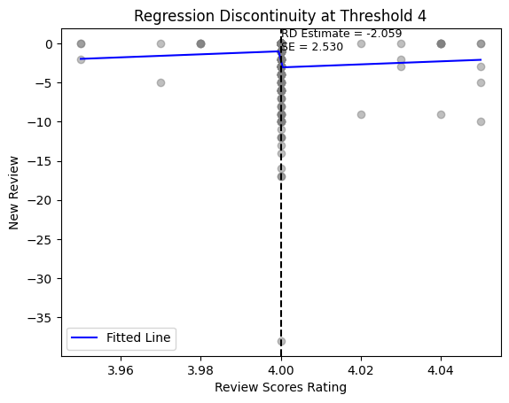

# Github Intro Guide
This is a task for you to get farmilar with Github. You will be asked to replicate a simple code. 

## Notes about Branches/Github Issues

You should start a new branch instead of the main branch for your coding task. For this simple replication
exercise, please create a branch named `lastname_firstname_city_replication` so I could see your result. You could create 
your branch based on the `main` branch I created. 

Also, don't make any change to the main branch! You should do all your stuff on your branch.

## Getting Started

1. Ensure that [git lfs](https://git-lfs.github.com) and Python 3.10 are installed. On a Mac, it is recommended to use [Homebrew](https://brew.sh) to install git lfs.

2. Open a shell to the location where you wish to store the repo. You should avoid storing the repo in a synced directory (i.e., do not store it in a Dropbox, Box, or iCloud folder. Note that on many Macs, the Desktop and Documents folder is synced with iCloud.). Once you have navigated to the location where you wish to store the repo, clone the repository, and navigate to its root.
    ```bash
    git lfs clone https://github.com/sz549/Github_Intro_Guide.git
    cd Github_Intro_Guide
    git lfs install
    ```
3. Create/activate a Python virtual environment and install the Python dependencies.
    ```bash
    # Store package names in this text file.
    python3 --version           # Check that your version is 3.10
    python3 -m venv venv        # This will name your virtual environment "venv"
    source env/bin/activate     # This activates your virtual environment
    ```

Note: I use Windows system and Github Desktop. There are various ways you could choose. Please 
check Github website/ Chatgpt for reference. 

## Rating RD Design Replication Exercise 

For this simple replication exercise, I want you to replicate a simple exercise using the [Airbnb 
public data](http://insideairbnb.com/get-the-data/). We want to see what is the effect of rating on sales.
In order to be able to do the casual inference, one way in the literature is to use the left-digit bias in rating.
That is, consumers value rating 4.05 much higher than rating 3.95. But the true qualities of listings near 
the rating of 4 are very close. If we do see there is a `jump` of sales at the cutoff of 4, we could argue
this is the casual effect of rating on sales. 

We want to do this RD exercise using the Airbnb public data. The goal is to see whether there is a 
clear jump on sales, as approximated by new reviews, near rating at 4 for listings. The guidance is as below: 

1. Go to [Airbnb public data](http://insideairbnb.com/get-the-data/) and download the listings.csv.gz for one city. 
There should be quarterly data for the last 12 months. You could save the data into the path 'data/raw/City'. The goal 
is to construct a panel data with 4 screenshots. For example, if you choose the city Boston, click `show archived data`,
you will see 4 `listings.csv.gz` for Sept 16th, 2023, June 21st 2023, 19 March 2023 and 21 Dec 2022. 


Download the `listings.csv.gz` and save them into the path `data/raw/City`.

2. Run the code below for data cleaning. 

    ```bash
    python code/data_cleaning.py
    ```
3. Run the code below to get the RD graph. 

    ```bash
    python code/rating_rd.py
    ```

Below is the graph for reference. 


Please pull origin after you finished the graph. Please note that you could edit/revise the codes above.
The code is just for reference. Please upload the rd graph in your readme file and write a short explanation.
Make sure your code is readable with sufficient comments. Also, make the commit message as clear as possible.



This is the rd graph based on the data of Chicago. According to the RD Estimate and standard Error, I can calculate the t statistic:
t = -2.059390269141655 / 2.5297285470442756 ≈ -0.813
Based on the calculation, for a t statistic of -0.813, in the case of degrees of freedom approaching infinity, the two-tailed p-value is approximately 0.416.
This suggests that at a significance level of 0.05, we fail to reject the null hypothesis, indicating that the RD estimate is not statistically significant.
